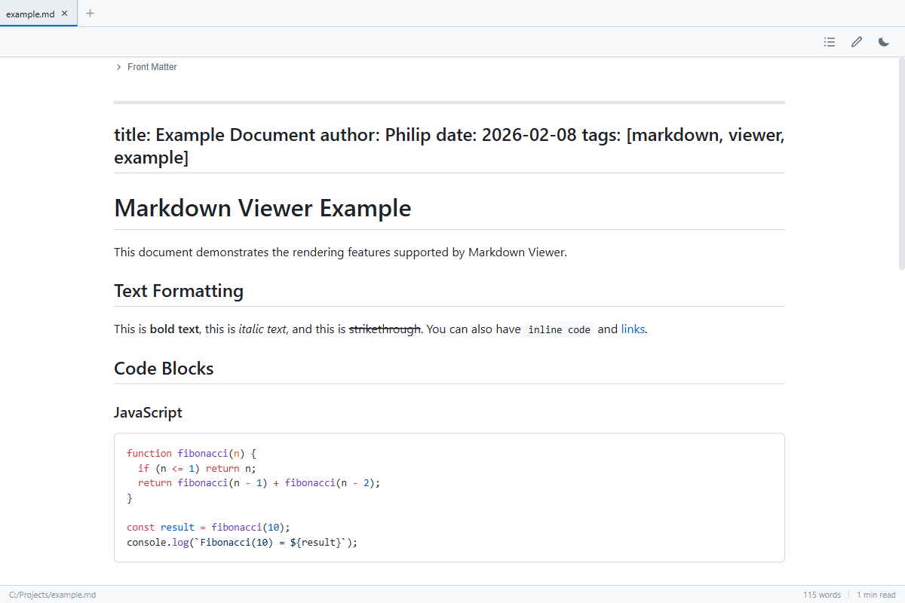

# Markdown Viewer

A lightweight desktop Markdown viewer with GitHub-style rendering, syntax highlighting, and a built-in editor.



## Features

- **GitHub-style rendering** — clean, familiar Markdown display powered by markdown-it
- **Syntax highlighting** — 30+ languages via Shiki with automatic theme matching
- **Dark and light themes** — toggle between themes with a single click
- **Split-pane editor** — edit Markdown with a live side-by-side preview
- **Tabbed interface** — open and work with multiple files at once
- **Table of Contents** — auto-generated from document headings
- **Live reload** — file watching detects external changes and refreshes automatically
- **PDF export** — save any document as a styled PDF
- **Math rendering** — LaTeX equations via KaTeX
- **Front matter** — YAML front matter is parsed and displayed in a banner
- **Search** — find text within the rendered document with match highlighting
- **Drag and drop** — open files by dropping them onto the window
- **Keyboard shortcuts** — Ctrl+O open, Ctrl+S save, Ctrl+E toggle editor, and more

## Getting Started

Requires [Rust](https://rustup.rs/) and Node.js.

```bash
npm install
npm run tauri:dev
```

## Build & Package

```bash
# Package as a Windows installer (~5 MB)
npm run tauri:build
```

The installer is written to `src-tauri/target/release/bundle/nsis/`.

## Tech Stack

- [Tauri 2](https://tauri.app/) — desktop runtime (Rust + system WebView)
- [React](https://react.dev/) — UI framework
- [Vite](https://vite.dev/) — build tooling
- [markdown-it](https://github.com/markdown-it/markdown-it) — Markdown parser
- [Shiki](https://shiki.style/) — syntax highlighting
- [KaTeX](https://katex.org/) — math rendering
- [DOMPurify](https://github.com/cure53/DOMPurify) — HTML sanitization
